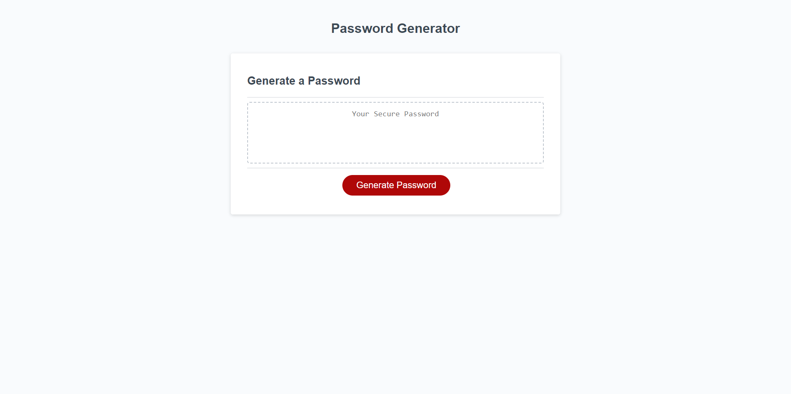

# Personalize and Generate a Password

## Description

The motivation for this project was to create a password generator application so that an employee who has access to sensitive data can randomly generate a password that meets certain criteria. The generator will generate a random strong password to prive greater securite for the sensitive data the employee has access to.

## Usage

To navigate on the web application, click on the red generate button. It will pop up a prompt and ask the user questions regarding the criteria they desire in generating their password. Once all the prompts are all completed and satisfy the requirements, then the password will appear in the small window above the red generate button.

## Application Image and Link

The following image shows the web application's appearance. You can also go to the web application by clicking the following link. https://chelleyoungw.github.io/new-and-improved-password-generator/

 
## Credits

Chelle Wood (student)

## License

Please refer to the MIT LINCESE in the repo.